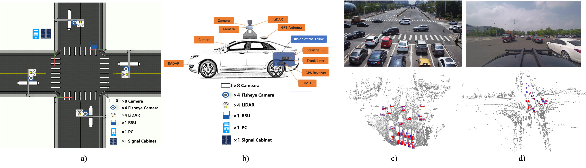

# OpenDAIRV2X
## Introduction
To accelerate computer vision research and innovation for Vehicle-Infrastructure Cooperative Autonomous
Driving (VICAD), we release DAIR-V2X Dataset, which is
the first large-scale, multi-modality, multi-view dataset from
real scenarios for VICAD.
Furtherly, we introduce the Vehicle-Infrastructure Cooperative 3D
Object Detection (VIC3D) task, which formulate the problem of cooperatively locating and identifying 3D
objects using sensory inputs from both vehicle and infrastructure.
To resolve the VIC3D object detection task and facilitate future research, 
we also introduce our VIC3D object detection benchmark as well as an extensive 3D detection benchmark for those who are interested in Single-View (SV) 3D detection tasks.
In order to facilitate researchers to use the dataset and reproduce the entire benchmark,
we open source the OpenDAIRV2X, towards serving VICAD research community.


## News
* [2022.11] 🔥 We are running the first [VIC3D Object Detection challenge](https://aistudio.baidu.com/aistudio/competition/detail/522/0/introduction). 
* [2022.07] We release the OpenDAIRV2X codebase v1.0.0.
  The current version can faciliate the researchers to use the DAIR-V2X dataset and reproduce the benchmarks.
* [2022.03] Our Paper "DAIR-V2X: A Large-Scale Dataset for Vehicle-Infrastructure Cooperative 3D Object Detection" has been accepted by CVPR2022.
  Arxiv version could be seen [here](https://arxiv.org/abs/2204.05575).
* [2022.02] DAIR-V2X dataset is availale [here](https://thudair.baai.ac.cn/index).
  It can be unlimitedly downloaded within mainland China. 

  
## Major features 
- **Support Train/Evaluation for VIC3D**

  It will directly support model training and evaluation for VIC3D. 
  Now the model inference and model training are mainly based on MMDetection3D, which is not quite convenient to carry the VICAD research.
  
- [x] Evaluation (Model inference is based on MMDetection3D)
- [x] Training based on MMDetection3D
- [ ] Direct Evaluation with DAIR-V2X Framework
- [ ] Direct Training with DAIR-V2X Framework


- **Support different fusion methods for VIC3D**
  
  It will directly support different fusion methods including early fusion/feature fusion/late fusion.
  Now it supports early fusion and late fusion.
- [x] Early Fusion
- [ ] Feature Fusion
- [x] Late Fusion
  
- **Support multi-modality/single-modality detectors for VIC3D**
  
  It will directly  support different modaility detectors including image-modality detector, pointcloud-modality detector and image-pointcloud fusion detector. 
  Now it supports image-modality detector ImvoxelNet, pointcloud-modality detector PointPillars.
- [x] Image-modality
- [x] Pointcloud-modality
- [ ] Multi-modality


- **Support Cooperation-view/single-view detectors for VIC3D**
  
  It directly supports different view's detectors for VIC3D, including infrastructure-view detector, 
  vehicle-view detector, vehicle-infrastrucure cooperation-view detector.
- [x] Infrastructure-view
- [x] Vehicle-view
- [x] Cooperation-view

## Benchmark

VIC3D Benchmark is as following:

| Modality  | Fusion  | Model      | Dataset   | AP-3D (IoU=0.5)  |        |        |         | AP-BEV (IoU=0.5)  |       |        |         |   AB   |
| :-------: | :-----: | :--------: | :-------: | :----: | :----: | :----: | :-----: | :-----: | :---: | :----: | :-----: | :----: |
|           |         |            |           | Overall | 0-30m | 30-50m | 50-100m | Overall | 0-30m | 30-50m | 50-100m |        |
| Image     | VehOnly | ImvoxelNet | VIC-Sync  |    9.13   | 19.06         | 5.23  | 0.41   | 10.96   | 21.93           | 7.28  | 0.78   | 0     |                    
|           | InfOnly | ImvoxelNet | VIC-Sync  |  14.02   | 20.56         | 8.89  | 10.57   | 22.10   | 27.33           | 17.45  | 18.92   | 309.38 |  
|       | Late-Fusion | ImvoxelNet | VIC-Sync  |   18.77   | 33.47         | 9.43  | 8.62    | 24.85   | 39.49           | 14.68  | 14.96   | 309.38|                    
|Pointcloud | VehOnly | PointPillars | VIC-Sync | 48.06  | 47.62 | 63.51  | 44.37   | 52.24   | 30.55 | 66.03  |  48.36  | 0      | 
|           | InfOnly | PointPillars | VIC-Sync | 17.58  | 23.00 | 13.96  | 9.17    | 27.26   | 29.07 | 23.92  | 26.64   | 478.61      |        
|  | Early Fusion | PointPillars | VIC-Sync    | 62.61                    | 64.82                  | 68.68                   | 56.57                    | 68.91                     | 68.92                   | 73.64                    | 65.66                     | 1382275.75 |
|       | Late-Fusion | PointPillars | VIC-Sync | 56.06  | 55.69 | 68.44  | 53.60   | 62.06   | 61.52 | 72.53  | 60.57   | 478.61 |                         
|       | Late-Fusion | PointPillars |VIC-Async-1| 53.80 | 53.26 | 67.40  | 50.85   | 59.94   | 59.51 | 71.45  | 57.74   | 341.08 | 
|  | Early Fusion | PointPillars | VIC-Async-1 | 57.35                    | 57.92                  | 66.23                   | 51.70                    | 64.06                     | 62.44                   | 71.42                    | 61.16                     | 1362216.0  |                                                             
|       | Late-Fusion | PointPillars |VIC-Async-2| 52.43 | 51.13 | 67.09  | 49.86   | 58.10   | 57.23 | 70.86  | 55.78   | 478.01 |
|       | TCLF        | PointPillars |VIC-Async-1| 54.09 | 53.43 | 67.50  | 51.38   | 60.19   | 59.52 | 71.52  | 58.31   | 907.64 | 
|       | TCLF        | PointPillars |VIC-Async-2| 53.37 | 52.41 | 67.33  | 50.87   | 59.17   | 58.25 | 71.20  | 57.43   | 897.91 |   

SV3D Benchmark based on DAIR-V2X-V is as following:

|  Modality  |     Model    |  Car  |        |       | Pedestrain |        |       | Cyclist |        |       |  
|:----------:|:------------:|:-----:|:------:|:-----:|:----------:|:------:|:-----:|:-------:|:------:|:-----:| 
|            |              |  Easy | Middle |  Hard |    Easy    | Middle |  Hard |   Easy  | Middle |  Hard | 
| Image      | ImvoxelNet   | 38.37 | 24.28  | 21.54 |  4.54      | 4.54   | 4.54  | 10.38   | 9.09  | 9.09 |    
| Pointcloud | PointPillars | 61.76 | 49.02  | 43.45 | 33.40      | 24.68  | 22.39 | 38.24   | 33.80  | 32.35 | 
| Pointcloud | SECOND       | 69.44 | 59.63  | 57.63 | 43.45      | 39.06  | 38.78 | 44.21   | 39.49  | 37.74 |  
| Image+Pointcloud | MVXNet | 69.86 | 60.74  | 59.31 | 47.73      | 43.37  | 42.49 | 45.68   | 41.84  | 40.55 | 

SV3D Benchmark based on DAIR-V2X-I is as following:

|  Modality  |     Model    |  Car  |        |       | Pedestrain |        |       | Cyclist |        |       |  
|:----------:|:------------:|:-----:|:------:|:-----:|:----------:|:------:|:-----:|:-------:|:------:|:-----:| 
|            |              |  Easy | Middle |  Hard |    Easy    | Middle |  Hard |   Easy  | Middle |  Hard | 
| Image      | ImvoxelNet   | 44.78 | 37.58  | 37.55 |  6.81      | 6.74   | 6.73  | 21.06   | 13.57  | 13.17 | 
| Pointcloud | PointPillars | 63.07 | 54.00  | 54.01 | 38.53      | 37.20  | 37.28 | 38.46   | 22.60  | 22.49 | 
| Pointcloud | SECOND       | 71.47 | 53.99  | 54.00 | 55.16      | 52.49  | 52.52 | 54.68   | 31.05  | 31.19 | 
| Image+Pointcloud | MVXNet | 71.04 | 53.71  | 53.76 | 55.83      | 54.45  | 54.40 | 54.05   | 30.79  | 31.06 | 


## OpenDAIRV2X Use
Please refer to [getting_started.md](docs/get_started.md) for Installation, Evaluation, Benchmark and Training etc for VIC3D.

## Acknowledgment
This project is not possible without the following codebases.
* [MMDetection3D](https://github.com/open-mmlab/mmdetection3d)
* [pypcd](https://github.com/dimatura/pypcd)

## Citation

If you find this project useful in your research, please consider cite:

```
@inproceedings{yu2022dairv2x,
    title={DAIR-V2X: A Large-Scale Dataset for Vehicle-Infrastructure Cooperative 3D Object Detection},
    author={Yu, Haibao and Luo, Yizhen and Shu, Mao and Huo, Yiyi and Yang, Zebang and Shi, Yifeng and Guo, Zhenglong and Li, Hanyu and Hu, Xing and Yuan, Jirui and Nie, Zaiqing},
    booktitle={IEEE/CVF Conf.~on Computer Vision and Pattern Recognition (CVPR)},
    month = jun,
    year={2022}
}
```

## Contaction

If any questions and suggenstations, please email to dair@air.tsinghua.edu.cn. 
